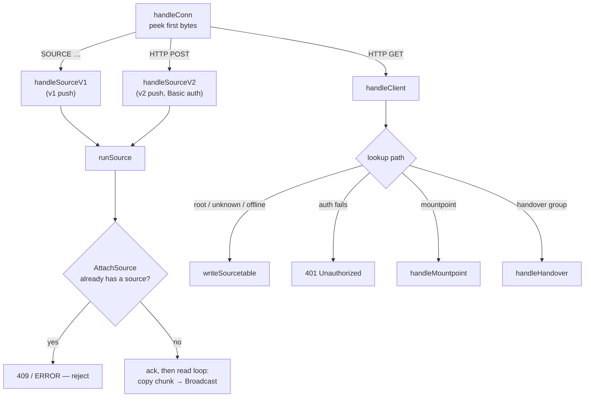
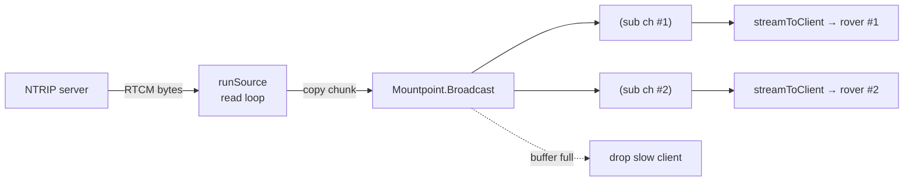
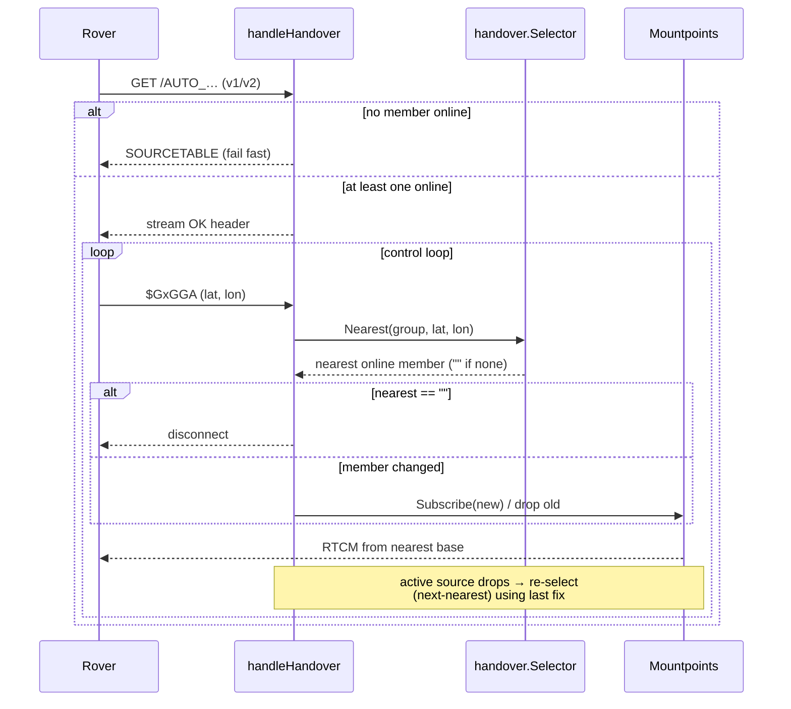

# ntrip-caster

NTRIP (Networked Transport of RTCM via Internet Protocol) caster written in Go.

## Features

- **NTRIP v1 and v2** for both clients (rovers) and servers (base stations).
  - Client pull: `GET /<mountpoint>` (`ICY 200 OK` for v1, chunked `gnss/data`
    for v2).
  - Server push: `SOURCE <pw> /<mp>` (v1) and `POST /<mp>` with Basic auth (v2).
  - Sourcetable on `GET /` or for unknown/offline mountpoints.
- **Handover endpoints.** A client connects to a virtual endpoint and streams
  its NMEA `GGA`; the caster subscribes it to the nearest online member base
  station and re-switches as the client moves. Members are grouped manually in
  config so each endpoint serves one RTCM flavor (e.g. RTCM 3.0, 3.2 MSM4/5/7).
- **Username/password authentication** for both clients and servers
  (passwords stored in plaintext, per the chosen configuration model).
  Individual mountpoints/handover endpoints can opt into anonymous client
  access with `open: true` (server push auth is unaffected).
- **Hot reload** via `systemctl reload` (SIGHUP): client users, mountpoint
  definitions, and base-station metadata/handover groups apply without
  dropping live connections. Changing the listen address requires a restart.

## Build

```sh
go build -o ntrip-caster ./cmd/ntrip-caster
```

## Run

```sh
cp config.example.yaml config.yaml   # edit credentials and mountpoints
./ntrip-caster -config config.yaml
./ntrip-caster -config config.yaml -check   # validate config and exit
```

## Architecture

| Package                 | Responsibility                                           |
| ----------------------- | -------------------------------------------------------- |
| `internal/config`       | YAML load, validation, hot-reload snapshot.              |
| `internal/caster`       | Runtime hub: mountpoints, source fan-out, subscribers.   |
| `internal/server`       | NTRIP v1/v2 wire protocol, auth, dispatch, handover.     |
| `internal/handover`     | Nearest-base selection (haversine) from a GGA fix.       |
| `internal/nmea`         | NMEA `GGA` parsing.                                      |
| `internal/sourcetable`  | Sourcetable (CAS/STR) rendering.                         |

Data flow: an NTRIP server attaches as the single source of a mountpoint; its
bytes are copied and broadcast to every subscribed client. Slow clients whose
queue overflows are disconnected rather than served a corrupted stream.

## Processing flow

### Connection dispatch (`server.handleConn`)

Every connection is one raw TCP socket. `handleConn` peeks the first bytes and
routes by request kind; `versionOf` then picks v1/v2 framing from the
`Ntrip-Version` header.



### Source → client fan-out (`caster`)

One source feeds many clients. `Broadcast` non-blocking-sends each chunk to
every subscriber's buffered channel; a subscriber that falls behind is dropped.



### Handover switching (`server.handleHandover` + `handover.Selector`)

A single control loop owns the client connection. The active member changes as
GGA fixes arrive or the current source drops, so the client connection survives
switches; it is closed only when no member is online.



## Configuration

See [`config.example.yaml`](config.example.yaml). Reloadable keys:
`client_users`, `mountpoints`, `handover`.

## systemd

See [`systemd/ntrip-caster.service`](systemd/ntrip-caster.service).

```sh
sudo cp ntrip-caster /usr/local/bin/
sudo install -d /etc/ntrip-caster && sudo cp config.yaml /etc/ntrip-caster/
sudo cp systemd/ntrip-caster.service /etc/systemd/system/
sudo systemctl daemon-reload && sudo systemctl enable --now ntrip-caster
# After editing the config:
sudo systemctl reload ntrip-caster
```

## Limitations / notes

- A handover connection fails immediately (sourcetable response) when no
  member base station is online. If the active base drops mid-stream, the
  client is automatically re-routed to the next-nearest online member using
  its last known position; the connection is closed only when no member
  remains online.
- Passwords are plaintext by design of the current config model.
- NTRIP v2 over TLS is not yet implemented (terminate TLS with a reverse proxy
  if required).
